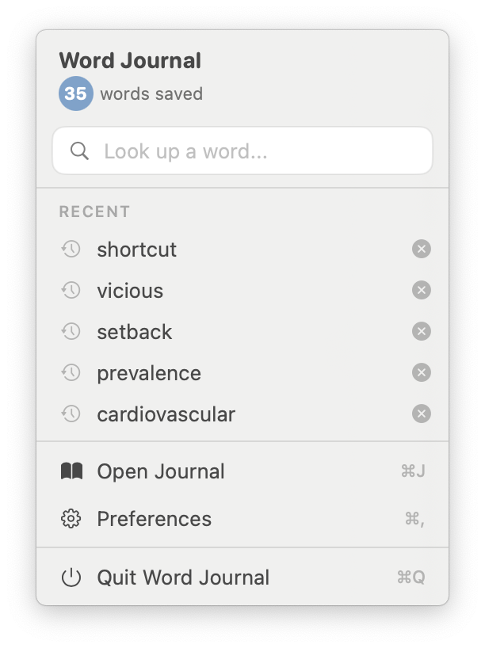
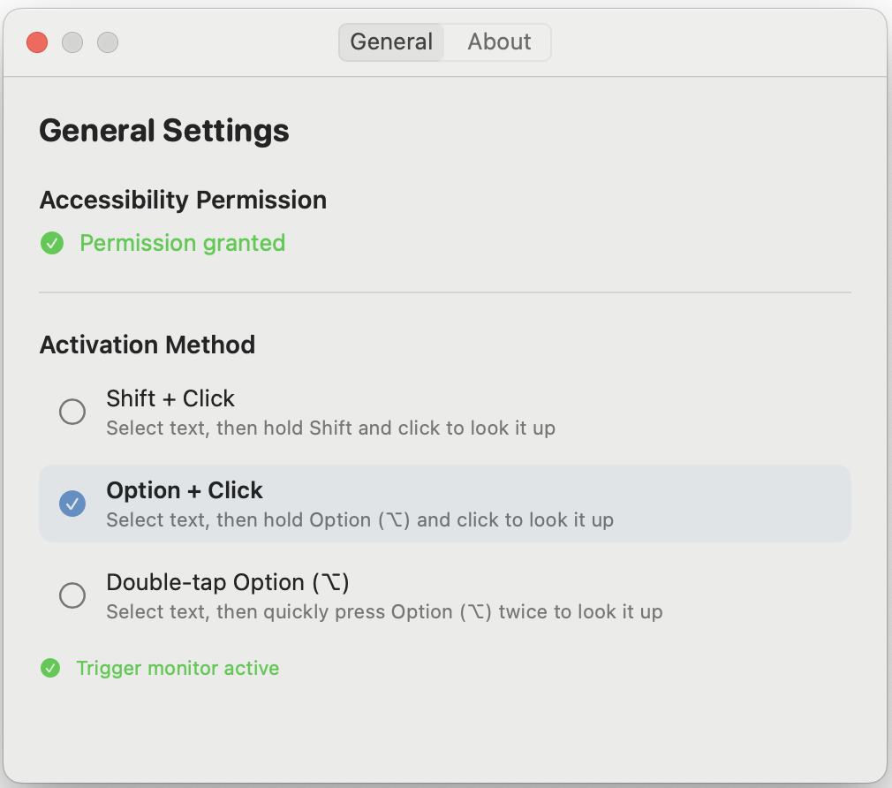

# Word Journal

A native macOS menu bar app for looking up words and phrases instantly from any application. Select text, trigger a lookup, and build your personal vocabulary journal — all without leaving your current window.

<p align="center">
  
</p>

## Screenshots

| Menu Bar | Definition Popup | Journal |
|:---:|:---:|:---:|
|  |  |  |

| Add to Journal | Preferences |
|:---:|:---:|
|  |  |

## Features

- **System-wide word lookup** — Select any text in any app, then Shift+Click or Double-tap Option to see its definition instantly
- **Menu bar lookup** — Type a word directly in the menu bar dropdown to look it up
- **macOS built-in dictionary** — Uses Apple's Dictionary Services for instant, offline definitions (~250,000+ words)
- **Smart lemmatization** — Automatically resolves inflected forms to their base word (e.g., "running" -> "run", "dogs" -> "dog")
- **Online fallback** — Free Dictionary API + Wiktionary API for phrases, idioms, and uncommon words
- **Pronunciation** — Click the speaker icon for audio playback (Dictionary API audio + Google TTS fallback, cached locally)
- **Per-definition add** — Each meaning has its own + button; add only the definitions you want to your journal
- **Editable journal** — Spreadsheet-style editing with search, sortable columns, per-row pronunciation, and "Play All"
- **Add words manually** — Use the + button in the journal to add words and auto-populate definitions
- **Export to CSV** — One-click export of your entire journal
- **Persistent caching** — Previously looked-up words load instantly, even offline
- **Keyboard shortcuts** — `⌘J` Open Journal, `⌘,` Preferences, `⌘Q` Quit

## Requirements

- macOS 13.0 (Ventura) or later
- Xcode 14.0 or later
- Swift 5.7 or later

## Setup Instructions

### 1. Create Xcode Project

1. Open Xcode
2. Create a new project:
   - Choose "macOS" -> "App"
   - Product Name: `WordJournal`
   - Interface: SwiftUI
   - Language: Swift
   - Uncheck "Use Core Data" (we use SQLite directly)

### 2. Add Files to Project

Add all files from the `WordJournal/` directory to your Xcode project, maintaining the folder structure:
- Models/
- Services/
- Views/
- Utilities/
- Resources/

### 3. Configure Info.plist

The `Info.plist` is already configured with:
- `LSUIElement` set to `YES` (hides app from dock)
- `NSAccessibilityUsageDescription` for accessibility permissions

### 4. Build and Run

1. Build the project (`⌘B`)
2. Run the app (`⌘R`)
3. Grant accessibility permissions when prompted
4. The app will appear in your menu bar

## Usage

### Look up a word or phrase

1. Select any text in any application (double-click a word, or drag to select a phrase)
2. Trigger the lookup:
   - **Shift+Click:** Hold Shift and click anywhere
   - **Double-tap Option:** Quickly press Option (⌥) twice
3. A floating popup appears with the definition(s)

Alternatively, click the menu bar icon and type a word in the search field.

### Add to journal

- Click the **+** button next to any definition you want to save
- You can add multiple meanings of the same word
- The checkmark confirms it's been added

### View and manage your journal

- Click the menu bar icon -> "Open Journal" (or `⌘J`)
- Search, sort by any column, edit cells directly
- Click the speaker icon on any row to hear pronunciation
- Use "Play All" to pronounce all filtered words in sequence
- Add new words manually with the "+" button at the bottom
- Export to CSV for use in flashcard apps or spreadsheets

### Preferences

- Click the menu bar icon -> "Preferences" (or `⌘,`)
- Switch between **Shift+Click** and **Double-tap Option** activation
- View accessibility permission status

## Project Structure

```
WordJournal/
├── WordJournalApp.swift              # App entry point, window management, lookup flow
├── Models/
│   ├── WordEntry.swift               # Journal entry model
│   └── DictionaryResult.swift        # Dictionary & Wiktionary API response models
├── Services/
│   ├── AccessibilityMonitor.swift    # Text selection (Accessibility API + pasteboard fallback)
│   ├── DictionaryService.swift       # Lookup (macOS Dictionary + API + Wiktionary + cache + lemmatization)
│   └── JournalStorage.swift          # SQLite storage with deduplication
├── Views/
│   ├── DefinitionPopupView.swift     # Floating definition popup with pronunciation
│   ├── JournalView.swift             # Editable journal table with search, sort, Play All
│   ├── MenuBarView.swift             # Menu bar popover with word lookup field
│   └── PreferencesView.swift         # Preferences (trigger method, permissions)
├── Utilities/
│   ├── TriggerManager.swift          # Shift+Click & Double-tap Option detection
│   └── HotKeyManager.swift           # Optional hotkey support
└── Resources/
    └── dictionary.json               # Local dictionary (optional, legacy)
```

## Technical Details

### Dictionary Lookup Pipeline

1. **In-memory cache** — Instant (<1ms)
2. **Persistent file cache** — Previously fetched results (~1ms)
3. **macOS Dictionary Services** — `DCSCopyTextDefinition` for offline, instant lookups
4. **Lemmatization** — `NLTagger` resolves inflected forms (plurals, tenses, etc.)
5. **Free Dictionary API** — Online fallback with pronunciation audio
6. **Wiktionary API** — Final fallback for phrases and idioms

### Text Selection

- **Accessibility API** — Primary method for reading selected text from other apps
- **Pasteboard fallback** — Simulates `⌘C` with retry mechanism for apps where AX fails (e.g., PDF viewers)
- **Background polling** — Caches selected text for faster lookups in AX-supported apps

### Storage

- **SQLite** database at `~/Library/Application Support/WordJournal/journal.db`
- **Dictionary cache** at `~/Library/Caches/WordJournal/dictionary/`
- **Audio cache** at `~/Library/Caches/WordJournal/audio/`

## Troubleshooting

### Accessibility Permissions Not Working

1. Go to System Settings -> Privacy & Security -> Accessibility
2. Ensure "WordJournal" is checked
3. If not listed, add it manually by clicking the "+" button
4. Restart the app after granting permission

### Trigger Not Responding

**Shift+Click:**
- Ensure only Shift is held (no Cmd, Option, or Control)
- Try selecting text first, then Shift+Click

**Double-tap Option:**
- Press Option twice quickly (within ~400ms)
- Do not press other keys between the two Option taps
- Check Preferences to confirm "Double-tap Option" is selected

### No Text Selected in PDF

The app uses a pasteboard fallback for PDF viewers. If lookup shows no text:
- Ensure the word/phrase is actually selected (highlighted)
- Wait a moment after selecting before triggering

## Future Enhancements

- Chinese translation support
- Flashcard / quiz mode
- Cloud sync (iCloud or custom backend)
- Multiple language support
- Word frequency analysis

## License

Copyright 2026. All rights reserved.
